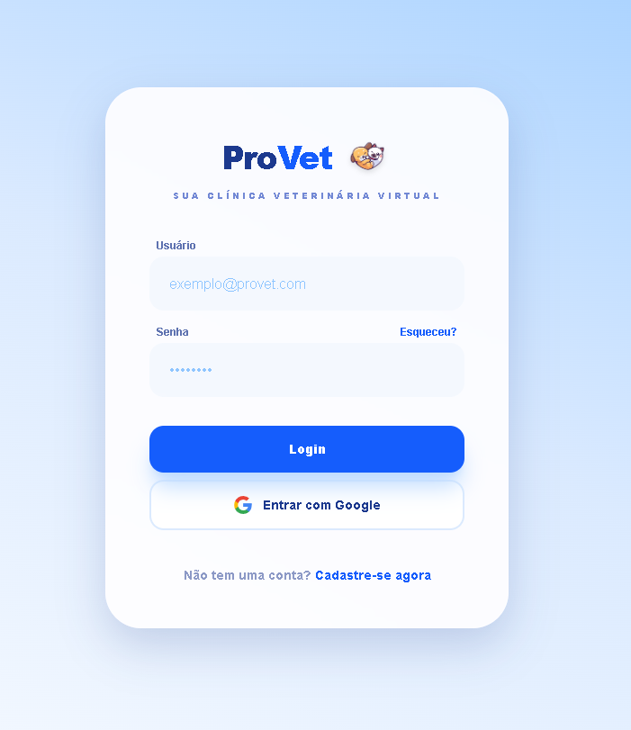

# 🐾 ProVet — Sistema SaaS para Gestão Veterinária

## 📌 Sobre o projeto

O **ProVet** é um sistema SaaS desenvolvido para facilitar a gestão de clínicas veterinárias, centralizando o controle de pets e consultas em uma única plataforma.

O projeto foi criado a partir de uma necessidade real de negócio, sendo aplicável ao contexto de uma clínica veterinária familiar.

A aplicação permite que cada usuário tenha acesso apenas aos seus próprios dados, garantindo segurança e isolamento de informações — um conceito essencial em sistemas SaaS.

---

## 🚀 Funcionalidades

* 🔐 Autenticação de usuários (login e cadastro)
* 🔑 Login com Google (OAuth)
* 🛡️ Isolamento de dados por usuário (cada usuário acessa apenas seus dados)
* 🐶 Cadastro e gerenciamento de pets
* 📅 Agendamento de consultas
* 📊 Dashboard administrativo

---

## 🧠 Conceitos aplicados

* Multi-tenant (isolamento de dados por usuário)
* Autenticação e autorização
* Integração com backend (BaaS)
* Componentização e organização de código
* Boas práticas com aplicações modernas

---

## 🛠️ Tecnologias utilizadas

* **Next.js**
* **TypeScript**
* **Supabase** (Auth + Database)

---

## 🔐 Autenticação e Segurança

O sistema utiliza autenticação segura com:

* Login tradicional (email e senha)
* Login com Google (OAuth)

Além disso, cada usuário possui acesso restrito apenas aos seus próprios dados, garantindo:

* Privacidade
* Segurança
* Separação de informações entre usuários

---

## 🌐 Demonstração

🔗 Acesse: https://provet-itape.vercel.app/
---

## 💻 Repositório

💻 GitHub: (https://github.com/Juholiver/provet)

---

## 📷 Preview

---

## 🎯 Objetivo

O objetivo do ProVet é simular um sistema real utilizado por clínicas veterinárias, aplicando conceitos de desenvolvimento moderno e boas práticas de software.

---

## 📈 Possíveis melhorias futuras

* Sistema de notificações
* Integração com pagamentos
* Controle de usuários por clínica
* Histórico completo de consultas
* Deploy em ambiente de produção com domínio próprio

---

## 🤝 Contribuição

Contribuições são bem-vindas!
Sinta-se à vontade para abrir issues ou pull requests.

---

## 📩 Contato

Se quiser trocar uma ideia ou dar um feedback, fique à vontade para entrar em contato 🚀
